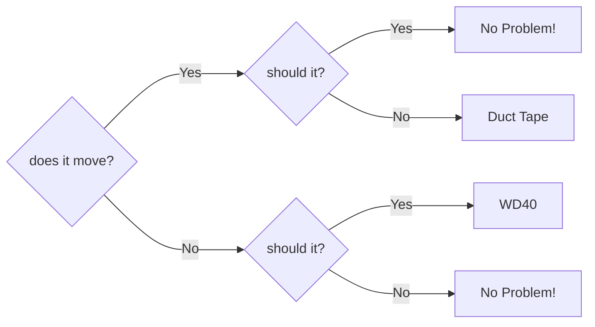

# Flowchart

See https://mermaid-js.github.io/mermaid/#/flowchart

```mermaid
flowchart LR
  A{does it move?}
  B{should it?}
  A --->|Yes| B
  B --->|Yes| D
  D[No Problem!]
  B --->|No| E
  E[Duct Tape]
  C{should it?}
  A --->|No| C
  C --->|Yes| F
  F[WD40]
  C --->|No| G
  G[No Problem!]
```
